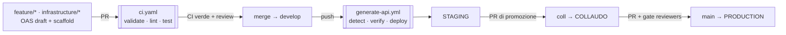

# microservice-media-manager

> **Patto di sviluppo, test e rilascio — approccio Contract-First (OAS 3.0)**
>
> Documento condiviso a cui aderisce chiunque entri nel progetto, in qualunque ruolo. Definisce
> *come* si progetta, genera, testa e rilascia un microservizio e *quali regole* governano il
> passaggio tra ambienti. Questo README dà i concetti **ad alto livello**; gli approfondimenti
> vivono in [`doc/`](doc/README.md).

## Cos'è

Microservizio Python **contract-first** e **multi-dominio**: ogni dominio
(`openapi/<dominio>/api.yaml`) è una spec OpenAPI 3.0 — l'unica fonte di verità — da cui si
**genera** lo scaffold, tenuto separato dalla logica custom. Ogni dominio è un microservizio
deployabile in modo indipendente. Domini attivi: **`media`** (listing media) e **`source`**
(bridge verso file system + database, pensato per il play da browser).

## Mappa della documentazione

| Dove | Contenuto |
|------|-----------|
| **README** (questo) | concetti ad alto livello: sviluppo condiviso + gestione pipeline |
| [doc/branching-strategy.md](doc/branching-strategy.md) | modello di branching e promozione tra ambienti |
| [doc/pipeline.md](doc/pipeline.md) | workflow CI/CD, deploy, proxy, ambienti e secret |
| [doc/development.md](doc/development.md) | patto di sviluppo in dettaglio (contract-first, test, convenzioni) |
| [doc/domains-and-api.md](doc/domains-and-api.md) | API per dominio, architettura source, implementazioni attuali/future |
| [doc/repository-governance.md](doc/repository-governance.md) | permessi, review, come aggiungere un validatore esterno |
| [doc/changelog.md](doc/changelog.md) | cosa è stato fatto dall'ultimo README a oggi |
| [deploy/README.md](deploy/README.md) · [deploy/storage/README.md](deploy/storage/README.md) | runbook di deploy e object storage |

---

## Sviluppo condiviso — concetti base

- **Contract-first.** Si scrive prima l'OAS (`openapi/<dominio>/api.yaml`), poi l'implementazione.
  Il contratto è draft in `feature/*`/`infrastructure/*`, **confermato** quando entra in `develop`.
- **Generato vs custom, separati.** Lo scaffold (`generated/`, **gitignored**) è rigenerabile e non
  si edita mai a mano; la logica vive in `src/domains/<dominio>/`. A runtime il server **non** usa
  `generated/`: connexion carica la spec e risolve verso i controller in `src/`.
- **Routing `/v0`.** Le path nelle spec sono relative e includono il dominio (`/media`,
  `/source/media`); `src/app.py` applica `base_path=/v0` → URL `/v0/media`, `/v0/source/media`.
- **Sicurezza.** Endpoint protetti via header `X-API-Key` (handler `src/security.py`); il valore
  arriva dai secret dell'Environment GitHub.
- **Dependency injection.** Controller *thin*; le dipendenze (repository, storage) sono assemblate
  da una **factory**, così si scambiano implementazioni senza toccare la logica.

| Ruolo | Cosa fa |
|-------|---------|
| **Sviluppatore** | definisce/aggiorna l'OAS, implementa i controller in `src/`, scrive i test |
| **Validatore** | revisiona e **approva** la PR verso un branch d'ambiente |
| **Maintainer** | gestisce branch protection, environment, secret, gate di produzione |

Principio: **nessun codice raggiunge un ambiente senza un doppio via libera** — la macchina (CI
verde) e l'umano (approvazione del validatore). Dettagli in [doc/development.md](doc/development.md).

---

## Gestione della pipeline — concetto

**PR aperta = test. Merge = deploy.** Nulla viene rilasciato durante la review; il deploy scatta
solo quando il merge produce un `push` sul branch d'ambiente. Due dimensioni **ortogonali**: il
**branch** decide l'ambiente, i **path cambiati** decidono quali domini (ri)deployare.

| Branch | Ambiente | Trigger |
|--------|----------|---------|
| `feature/*`, `infrastructure/*` | — (locale / artifact) | `api-draft.yaml` (scaffold) |
| `develop` | **staging** | `generate-api.yml` (genera + deploya) |
| `coll` | **collaudo / UAT** | `generate-api.yml` |
| `main` | **production** | `generate-api.yml` + gate reviewers |

Tre workflow: **`api-draft.yaml`** (scaffold rapido su branch effimeri), **`ci.yaml`** (su PR:
validate strict + generate + lint + test, **nessun deploy**), **`generate-api.yml`** (su push ai
branch d'ambiente: `detect` domini → `verify` su runner cloud → `deploy` selettivo sull'host via
self-hosted runner). Dettagli in [doc/pipeline.md](doc/pipeline.md).



---

## Quick start

```bash
make install            # dipendenze (runtime + dev)
make domains            # elenca i domini rilevati
make validate           # valida ogni openapi/<dominio>/api.yaml
make generate-all       # valida + genera server+client per tutti i domini
make test               # unit + integration
make lint               # ruff su src/ e tests/

python -m src.app                 # tutti i domini, :8080
DOMAIN=media python -m src.app    # un solo dominio
MOCK=1 python -m src.app          # risposte dagli examples dell'OAS
```

Elenco completo dei target in [doc/development.md](doc/development.md).

## Struttura del repository

```
openapi/<dominio>/api.yaml        ← contratto OAS del dominio (path relative)
openapi/shared/components.yaml    ← componenti OAS condivisi (ApiKeyAuth, Health, Error, PaginationMeta)
openapi/config/                   ← config del generator
src/app.py                        ← wiring multi-dominio (base_path=/v0, discovery)
src/security.py                   ← validazione API key (connexion 3.x)
src/domains/<dominio>/            ← controllers / services (+ repositories, storage, factory per source)
src/client/auth.py                ← factory ApiClient per dominio
config/<dominio>/<env>.env        ← variabili NON sensibili per ambiente
Dockerfile                        ← unico, parametrico (ARG DOMAIN)
docker-compose.<dominio>.yml      ← unità deployabile per dominio
deploy/proxy/                     ← reverse-proxy interno (nginx generata dai domini)
deploy/storage/                   ← object storage MinIO (coll/prod)
tests/{unit,integration,contract} ← test
generated/<dominio>/              ← scaffold rigenerato (gitignored, MAI editato)
.github/workflows/                ← api-draft.yaml · ci.yaml · generate-api.yml
doc/                              ← approfondimenti (vedi mappa sopra)
```

## Ambienti

| Environment | Branch | Runner | Host | Protezioni |
|-------------|--------|--------|------|------------|
| `staging` | `develop` | `self-hosted,staging` | dev locale | — |
| `collaudo` | `coll` | `self-hosted,collaudo` | LXC Proxmox | — |
| `production` | `main` | `self-hosted,production` | LXC Proxmox | Required reviewers |

Secret per ambiente (stessi nomi, valori diversi): `API_HOST`, `API_KEY`, `API_SECRET`; per il
dominio `source` in coll/prod anche `MINIO_*` e `STORAGE_*`. Vedi [doc/pipeline.md](doc/pipeline.md).

---

*Documento vivente: ogni modifica al processo passa da una PR, soggetta alle stesse regole di
revisione del codice.*
