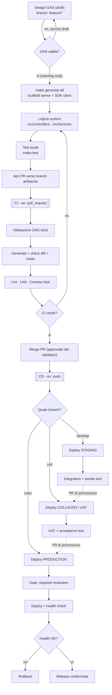

# microservice-media-manager

> **Patto di sviluppo, test e rilascio — approccio Contract-First (OAS 3.0)**
>
> Questo documento è l'accordo condiviso a cui aderisce chiunque entri a far parte del
> progetto, in qualunque ruolo (sviluppatore, validatore, maintainer). Definisce *come*
> si progetta, si genera, si testa e si rilascia un microservizio, e *quali regole* governano
> il passaggio da un ambiente all'altro. Leggerlo e accettarlo è il prerequisito per contribuire.

---

## Indice

1. [Filosofia: perché contract-first](#1-filosofia-perché-contract-first)
2. [Ruoli e responsabilità](#2-ruoli-e-responsabilità)
3. [Strategia di branching](#3-strategia-di-branching)
4. [Ciclo di vita: dal design al rilascio](#4-ciclo-di-vita-dal-design-al-rilascio)
5. [Struttura del repository](#5-struttura-del-repository)
6. [Strategia di generazione del codice](#6-strategia-di-generazione-del-codice)
7. [Autenticazione dinamica nel client](#7-autenticazione-dinamica-nel-client)
8. [Sviluppo locale e mock](#8-sviluppo-locale-e-mock)
9. [Pipeline CI/CD](#9-pipeline-cicd)
10. [Ambienti GitHub, secret e gate](#10-ambienti-github-secret-e-gate)
11. [Strategia di test](#11-strategia-di-test)
12. [Promozione tra ambienti](#12-promozione-tra-ambienti)
13. [Definition of Done](#13-definition-of-done)

---

## 1. Filosofia: perché contract-first

Il **contratto API (OpenAPI 3.0)** è l'unica fonte di verità di ogni dominio: il progetto è
**multi-dominio**, con una spec per `openapi/<dominio>/api.yaml`. Si progetta prima
l'interfaccia (lo YAML), poi la si implementa. Il contratto è ciò che developer e consumer
condividono: finché è in `feature/*` è un **draft** discutibile e modificabile; diventa
**confermato** nel momento in cui entra nel primo branch d'ambiente (`develop`) tramite una
PR approvata.

Conseguenze pratiche di questa scelta:

- Il codice viene **generato** dal contratto (scaffold del server + SDK client), non scritto a mano.
- Il codice generato e la logica di business vivono in **directory fisicamente separate**, così
  che rigenerare non sovrascriva mai il lavoro custom.
- I consumer possono iniziare a integrarsi contro un **mock guidato dal contratto** prima ancora
  che l'implementazione reale esista.

---

## 2. Ruoli e responsabilità

| Ruolo | Cosa fa | Dove agisce |
|-------|---------|-------------|
| **Sviluppatore** | Definisce/aggiorna l'OAS in `feature/*`, implementa i controller in `src/`, scrive i test | branch `feature/*` |
| **Validatore / Reviewer** | Revisiona la PR, verifica coerenza del contratto e qualità, **approva** il passaggio verso un branch d'ambiente | PR verso `develop` / `coll` / `main` |
| **Maintainer** | Gestisce branch protection, environment, secret, approvazioni di deploy in produzione | impostazioni del repo |

Il principio: **nessun codice raggiunge un ambiente senza un doppio via libera** — la macchina
(CI verde) e l'umano (approvazione del validatore).

---

## 3. Strategia di branching

Modello **ibrido**: branch di feature effimeri + branch d'ambiente persistenti.

| Branch | Tipo | Ambiente mappato |
|--------|------|------------------|
| `feature/*` (es. `feature/list-all-media`) | Feature, effimero | — (locale / artifact) |
| `develop` | Ambiente, persistente | **staging** |
| `coll` | Ambiente, persistente | **collaudo / UAT** |
| `main` | Ambiente, persistente | **production** |

Ogni branch d'ambiente *è* la fonte di verità di ciò che è effettivamente deployato in
quell'ambiente (modello environment-branch / GitOps).

---

## 4. Ciclo di vita: dal design al rilascio



### Le fasi in sintesi

| Fase | Branch | Trigger | Ambiente | Azioni chiave | Esito |
|------|--------|---------|----------|---------------|-------|
| **0. Design** | `feature/*` | locale | — | Scrittura OAS draft, validazione warning-only | OAS non ancora confermato |
| **1. Scaffold + Dev** | `feature/*` | `push` | — | `make generate-all`, implementazione `src/`, mock locale | Prime chiamate statiche in locale |
| **2. CI** | `feature/* → env` | `pull_request` | — *(no deploy)* | OAS strict, generate + **check diff vuoto**, lint, unit, contract test | CI verde = merge abilitato |
| **3. Staging** | `develop` | `push` | `staging` | Generate + deploy, integration + smoke test | OAS **confermato**, prime chiamate statiche in ambiente condiviso |
| **4. Collaudo** | `coll` | `push` | `collaudo` | Deploy, UAT, acceptance test | Validazione funzionale / business |
| **5. Produzione** | `main` | `push` | `production` | **Required reviewers** → deploy → health check | Release o rollback |

---

## 5. Struttura del repository

```
microservice-media-manager/
├── README.md                       # questo documento
├── openapi/
│   ├── <dominio>/api.yaml          # contratto OAS 3.0 del dominio (es. media/, social/)
│   ├── shared/                     # componenti OAS condivisi tra domini
│   └── config/
│       ├── server-config.yaml      # config generator server (packageName per-dominio dal Makefile)
│       └── client-config.yaml      # config generator client
├── generated/                      # MAI editato a mano (rigenerabile, sacrificabile)
│   └── <dominio>/{server,client}   # scaffold Flask + SDK client, uno per dominio
├── src/                            # logica custom — il NOSTRO codice
│   ├── app.py                      # wiring multi-dominio (base_path, discovery)
│   ├── domains/<dominio>/
│   │   ├── controllers/            # implementazioni concrete
│   │   └── services/               # business logic
│   └── client/
│       └── auth.py                 # factory ApiClient per dominio (injection api_key/secret)
├── config/<dominio>/<env>.env      # variabili NON sensibili per ambiente
├── Dockerfile                      # unico, parametrico (ARG DOMAIN)
├── docker-compose.<dominio>.yml    # unità deployabile per dominio
├── tests/
│   ├── contract/                   # test di contratto (schemathesis)
│   ├── unit/
│   └── integration/
├── .openapi-generator-ignore       # cintura di sicurezza per la rigenerazione
├── Makefile
├── requirements.txt
├── requirements-dev.txt
└── .github/workflows/
    ├── ci.yaml                     # on: pull_request → valida + scaffold + test (NO deploy)
    ├── api-draft.yaml              # on: push feature/** → scaffold rapido (artifact)
    └── generate-api.yml            # on: push [develop,coll,main] → generate + deploy selettivo
```

**Regola d'oro:** `generated/` e `src/` sono mondi separati. Rigenerare `generated/` (anche con
`rm -rf generated/`) non tocca mai `src/`. A runtime il server non importa nemmeno `generated/`:
connexion carica la spec OAS e risolve verso i controller in `src/`.

### Multi-dominio: un microservizio per dominio

Ogni cartella `openapi/<dominio>/api.yaml` è un **dominio** = un microservizio deployabile in
modo indipendente. Aggiungere `openapi/social/api.yaml` crea il dominio `social` **senza
modificare Makefile né CI** (il Makefile scopre i domini con un wildcard).

- **Routing:** le path nelle spec sono relative (`/health`, `/items`); il prefisso `/<dominio>`
  è applicato come `base_path` nel wiring e instradato dal reverse-proxy
  (`host/media/*` → container media, `host/social/*` → container social).
- **Container:** un solo `Dockerfile` parametrico (`ARG DOMAIN`) → nessuna ambiguità di versioni;
  un `docker-compose.<dominio>.yml` per dominio come unità deployabile.
- **Deploy selettivo:** un push che tocca solo `openapi/media/**` ridistribuisce solo `media`.

---

## 6. Strategia di generazione del codice

Approccio **Interface-Implementation**:

- **Codice generato** (`generated/`) → firme delle operazioni, modelli, validazione, routing.
  È l'*interfaccia*, rigenerabile a piacimento.
- **Codice custom** (`src/`) → implementazioni reali. Il file `src/server/app.py` fa il *wiring*:
  dice al server di risolvere le `operationId` verso i nostri controller, non verso gli stub.

```python
# src/app.py  (estratto) — un base_path per dominio, discovery automatica
import connexion

def create_app(domains=None, mock=False):
    domains = domains if domains is not None else discover_domains()
    app = connexion.FlaskApp(__name__, specification_dir="openapi/")
    for domain in domains:
        app.add_api(
            f"{domain}/api.yaml",
            base_path=f"/{domain}",
            resolver=connexion.resolver.RelativeResolver(f"src.domains.{domain}.controllers"),
            strict_validation=True,
            validate_responses=True,
        )
    return app
```

### Il file `.openapi-generator-ignore`

Funziona come un `.gitignore` ma per la **generazione**: elenca i file che il generatore non deve
(ri)scrivere. Va posto nella root di ciascuna output directory. Grazie alla separazione di
directory è in gran parte una cintura di sicurezza, non la strategia primaria.

---

## 7. Autenticazione dinamica nel client

L'SDK generato espone `Configuration` e `ApiClient`. **Non si istanziano mai direttamente** nel
codice di business: si passa sempre da un factory unico (`src/client/auth.py`), così quando
arriverà l'API Gateway si modifica un solo file.

```python
# src/client/auth.py  (estratto) — un ApiClient per dominio
def build_api_client(domain, settings=None):
    client_pkg = importlib.import_module(f"{domain}_client")  # generated/<dominio>/client
    Configuration, ApiClient = client_pkg.Configuration, client_pkg.ApiClient
    settings = settings or AuthSettings.from_env()
    config = Configuration(host=settings.host)
    if settings.api_key:
        config.api_key["ApiKeyAuth"] = settings.api_key
    if settings.api_secret:
        config.api_key["ApiSecretAuth"] = settings.api_secret
    return ApiClient(configuration=config)
```

I valori (`API_HOST`, `API_KEY`, `API_SECRET`) provengono da variabili d'ambiente, alimentate in
CI/CD dai **secret dell'ambiente GitHub** corrispondente al branch di destinazione. Nessun segreto
è mai hardcoded o committato.

---

## 8. Sviluppo locale e mock

La CI invoca gli **stessi target** del `Makefile` usati in locale: zero divergenza tra "funziona
da me" e "funziona in CI". La versione di `openapi-generator` è **pinnata** per output identico.

| Comando | Effetto |
|---------|---------|
| `make install` | installa le dipendenze |
| `make domains` | elenca i domini rilevati |
| `make validate` | valida l'OAS di ogni dominio |
| `make generate-all` | valida + genera server + client per tutti i domini |
| `make generate-<dominio>` | genera il solo dominio indicato (es. `make generate-media`) |
| `make mock` | avvia l'app con MockResolver (tutti i domini) |
| `make test` | esegue i test su `src/` |
| `make clean` | rimuove `generated/` (sicuro grazie alla separazione) |

### Prime chiamate statiche

Le chiamate di test (es. con **Bruno**) sono possibili in **due momenti**:

1. **In locale (Fase 1)** — mock guidato dal contratto, Bruno punta a `localhost`:
   ```bash
   make mock                                            # tutti i domini, base_path /<dominio>, :8080
   npx @stoplight/prism-cli mock openapi/media/api.yaml # alternativa per singolo dominio
   ```
   Lo scaffold grezzo restituirebbe solo placeholder; il mock contract-driven restituisce gli
   `examples` definiti nello YAML.
2. **In DEV (Fase 3)** — dopo il merge in `develop`, lo stesso mock/stub è deployato in ambiente
   condiviso: Bruno punta all'URL di staging e il team/consumer si integra in parallelo, mentre
   l'implementazione reale viene completata. Quando i controller in `src/` sono pronti, gli stessi
   endpoint smettono di restituire gli example e iniziano a restituire dati reali — **senza che il
   contratto cambi**.

---

## 9. Pipeline CI/CD

Tre workflow, con responsabilità distinte:

- **`api-draft.yaml`** — `on: push` ai branch `feature/**`. Genera lo scaffold rapidamente e lo
  pubblica come *artifact* condivisibile. Validazione warning-only (lo YAML è ancora draft).
- **`ci.yaml`** — `on: pull_request` verso i branch d'ambiente. Validazione OAS *strict*, generate
  + **verifica che il diff sia vuoto** (il generato committato deve combaciare), lint, unit e
  contract test. **Nessun deploy.**
- **`generate-api.yml`** — `on: push` ai branch `[develop, coll, main]`. Il job `detect` mappa il
  branch all'ambiente e **calcola i domini cambiati** (diff dei path); la matrix `build-deploy`
  genera, builda e **deploya SOLO i domini impattati** nell'ambiente corrispondente. Una modifica
  a file condivisi (`Makefile`, `Dockerfile`, `requirements*.txt`, `src/app.py`, `src/client/`,
  `openapi/config/`, `openapi/shared/`) ridistribuisce **tutti** i domini.

### Il confine che tiene tutto insieme

**PR aperta = test. Merge = deploy.** Nulla viene rilasciato durante la review; il deploy scatta
solo quando il merge produce un `push` sul branch d'ambiente. Si usa `on: push` (non
`pull_request: closed`) perché cattura *ogni* modifica del branch — merge, squash, hotfix — e
`github.ref_name` indica direttamente l'ambiente target.

---

## 10. Ambienti GitHub, secret e gate

Si usano le **GitHub Environments** per gestire configurazioni e segreti diversificati:

| Environment | Branch consentito (deployment branch policy) | Protezioni |
|-------------|----------------------------------------------|------------|
| `staging` | `develop` | — |
| `collaudo` | `coll` | — |
| `production` | `main` | **Required reviewers** (approvazione manuale del deploy) |

Ogni environment definisce gli **stessi nomi di secret** (`API_HOST`, `API_KEY`, `API_SECRET`)
con **valori diversi**. Il job di deploy dichiara `environment: <nome>` e GitHub risolve
automaticamente i secret giusti — **nessun `if`/`case` nel workflow**.

Due livelli di gate complementari:

- **Branch protection** sui branch d'ambiente → richiede CI verde + approvazione reviewer **prima
  del merge** (gate sull'ingresso del codice).
- **Required reviewers** sull'environment `production` → richiede approvazione **prima del deploy**
  (gate sul rilascio).

---

## 10.1 Deploy / infrastruttura (self-hosted runner + reverse-proxy)

Runbook per (ri)configurare il deploy da zero. Dettaglio operativo in [`deploy/README.md`](deploy/README.md).

### Topologia (per host)
Ogni ambiente è **un host** con una rete docker `mediamgr`, un container **nginx** (reverse-proxy)
e un container per dominio:

```
host:${PROXY_HTTP_PORT:-80}  ──►  nginx (proxy)  ──►  /media/  → media:8080   (DOMAIN=media,  base_path=/media)
                                                  └─►  /social/ → social:8080  (DOMAIN=social, base_path=/social)
                                   rete docker interna "mediamgr"
```
- I container-dominio si chiamano come il dominio (`container_name: media`) e fanno solo `expose: 8080`:
  l'unico ingresso è il proxy. nginx usa il DNS interno di Docker e mantiene il prefisso
  (`proxy_pass http://media:8080…$request_uri`), coerente con `base_path=/<dominio>`.
- La `nginx.conf` è **generata dai domini** (`make proxy-config` → `deploy/proxy/gen-nginx-conf.sh`):
  aggiungere un dominio non richiede edit manuali del proxy.

### Mapping branch → ambiente → runner
| Branch | Environment | Label runner | Host |
|--------|-------------|--------------|------|
| `develop` | `staging` | `self-hosted,staging` | macchina dev locale |
| `coll` | `collaudo` | `self-hosted,collaudo` | LXC collaudo |
| `main` | `production` | `self-hosted,production` | LXC produzione (gate reviewers) |

### Pipeline di deploy (`generate-api.yml`)
`detect` (domini impattati + ambiente) → `verify` (runner cloud: generate+test, gate) →
`deploy` (self-hosted sull'host: `gen-nginx-conf` + `compose up -d` del proxy + `compose up -d --build`
del dominio + smoke `curl /<dominio>/health`). Build **sull'host**, nessun registry. Deploy
**selettivo**: solo i domini cambiati; un cambio a file condivisi rideploya tutti.

### Setup da zero (sintesi — vedi `deploy/README.md`)
1. Su ogni host: Docker+compose, utente nel gruppo `docker`, `docker network create mediamgr`.
2. Registra il self-hosted runner con label = nome environment
   (`./config.sh --labels self-hosted,<env>`), avvialo come servizio.
3. Imposta i secret per environment (`API_HOST/API_KEY/API_SECRET`) e, se la 80 non va bene,
   la variabile `PROXY_HTTP_PORT`.
4. Push sul branch dell'ambiente → deploy automatico.

⚠️ I self-hosted runner su repo pubblici sono rischiosi: il deploy parte solo su `push` ai branch
protetti, ma è consigliato rendere il repo **privato**.

## 11. Strategia di test

Piramide dei test: i livelli economici filtrano presto, quelli costosi girano tardi.

| Livello | Dove gira | Scopo |
|---------|-----------|-------|
| Validazione statica OAS | ogni push | il contratto è ben formato |
| Lint + Unit | CI (PR) | logica isolata, niente rete |
| Contract test (schemathesis) | CI + staging | l'implementazione rispetta lo schema |
| Integration | staging | contro servizi reali deployati |
| UAT / acceptance | collaudo | validazione funzionale / business |
| Smoke + health check | ogni deploy (rigoroso in prod) | il servizio è vivo, rollback armato |

---

## 12. Promozione tra ambienti

L'avanzamento verso la produzione avviene **per PR tra branch d'ambiente**, non per merge diretti:

```
feature/*  --PR-->  develop  --PR-->  coll  --PR-->  main
                   (staging)        (collaudo)    (production)
```

Ogni salto ripassa dal gate della CI; l'ultimo salto verso `main` aggiunge l'approvazione manuale
del deploy. Gli hotfix urgenti seguono una corsia separata (PR diretta su `main` con backport
verso `develop`/`coll`) — da definire in un addendum dedicato.

---

## 13. Definition of Done

Una feature è "done" quando:

- [ ] L'OAS è aggiornato e valida in modalità *strict*.
- [ ] `make generate-all` non produce diff non committato (`generated/` allineato).
- [ ] La logica vive in `src/`, mai in `generated/`.
- [ ] Esistono unit test e contract test verdi.
- [ ] La PR è approvata da almeno un validatore.
- [ ] Il deploy in staging passa integration + smoke test.
- [ ] La documentazione (questo README o gli addendum) riflette eventuali cambi di processo.

---

*Documento vivente: ogni modifica al processo passa da una PR su questo README, soggetta alle
stesse regole di revisione del codice.*
